# System Diagrams

## Harness Execution Flow Diagram

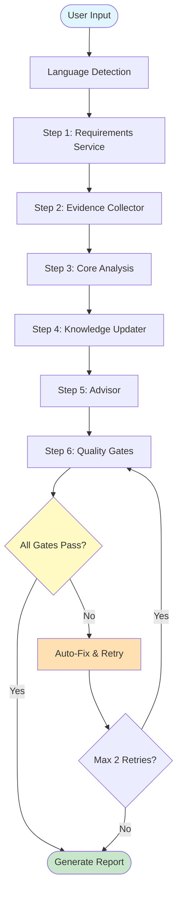

## Quality Gate System Diagram

```mermaid
flowchart LR
    Input[Report Draft] --> U1[Gate U1: Source Count]
    U1 --> U2[Gate U2: Disclosure]
    U2 --> U3[Gate U3: Evidence Tier]
    U3 --> U4[Gate U4: Language Match]
    U4 --> U5[Gate U5: Template Format]
    U5 --> U6[Gate U6: Claim Traceability]
    U6 --> G1[Gate G1: School/Form ID]
    G1 --> G2[Gate G2: Physiology Grounding]
    G2 --> G3[Gate G3: Species-Specific Care]
    G3 --> G4[Gate G4: Scenario Analysis]

    G4 --> Check{All Passed?}
    Check -->|Yes| Final[Final Report]
    Check -->|No| Remediate[Apply Auto-Fix]
    Remediate --> Check

    style Input fill:#e1f5fe
    style Final fill:#c8e6c9
    style Check fill:#fff9c4
    style Remediate fill:#ffe0b2
```

## Graceful Degradation Levels

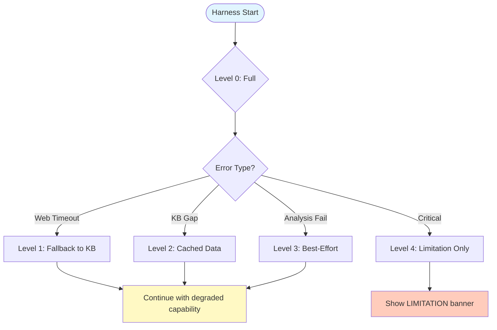

## Knowledge Pipeline Flow

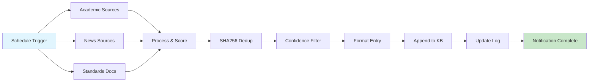

## Sub-Skill Interaction Diagram

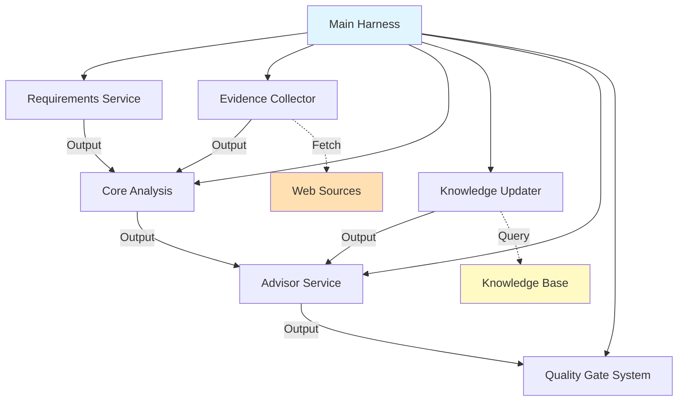

## Error Handling Flow

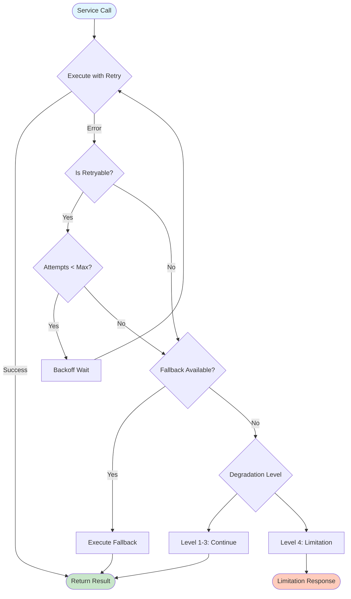

## Token Optimization Flow

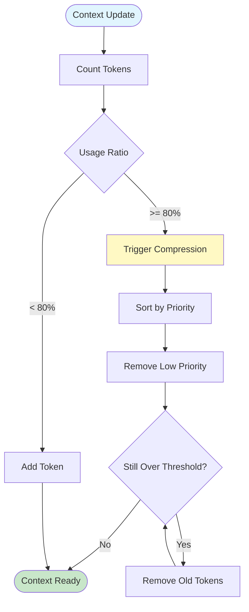

## Tool Invocation Flow

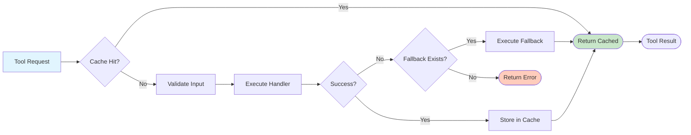

## Hook System Flow

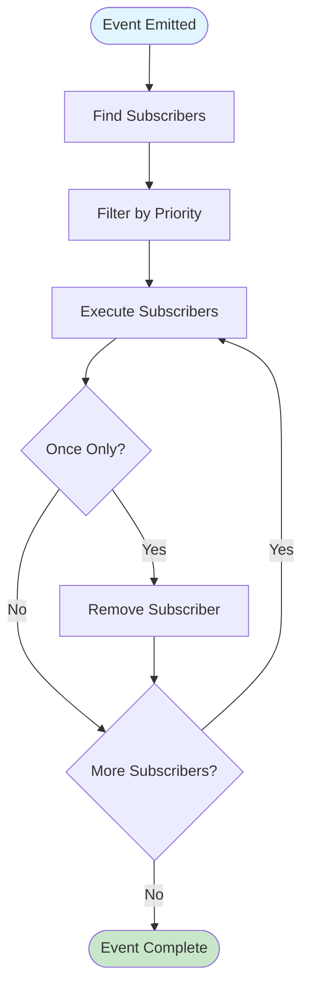

## Configuration Loading Flow

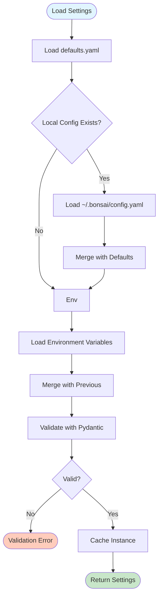

## Test Suite Structure

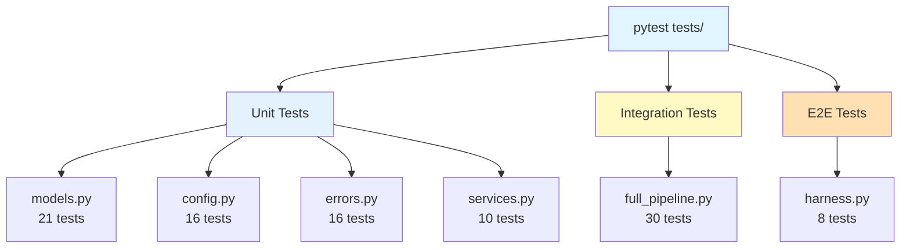

## Deployment Architecture

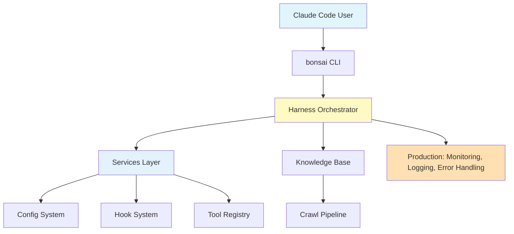
